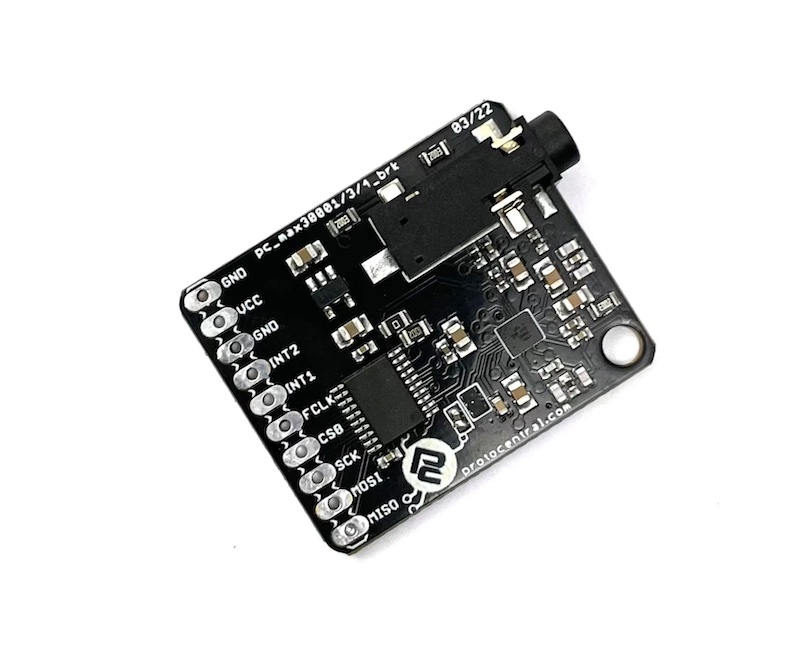

# Protocentral MAX30001 ECG and Bio-Impedance Breakout Board
[](https://github.com/Protocentral/protocentral_max30001_arduino_library/actions?workflow=Compile+Examples)

## Don't have one? [Buy it here](https://protocentral.com/product/protocentral-max30001/)



## Overview

MAX30001 is a single-lead ECG monitoring IC with built-in R-R interval detection, designed for wearable biomedical applications. This Arduino library provides a modern, easy-to-use interface for accessing all chip features.

**Key Capabilities:**
- Single-lead ECG acquisition at 128/256/512 SPS
- Bio-impedance (BioZ) measurement for respiration monitoring
- Hardware R-R interval (heartbeat) detection
- Lead-off detection for electrode connectivity monitoring
- Programmable gain (80 V/V or 160 V/V)
- Adjustable digital filters
- Ultra-low power consumption (85 µW)
- Works with just 2 electrodes (no DRL electrode needed)
- SPI communication interface

---

## Quick Start

### Installation
1. Download this library as a ZIP file
2. In Arduino IDE: **Sketch → Include Library → Add .ZIP Library**
3. Select the downloaded ZIP file

### Basic Example (5 lines to get started)

```cpp
#include <SPI.h>
#include <protocentral_max30001.h>

MAX30001 sensor(7);  // CS pin = 7

void setup() {
    Serial.begin(115200);
    sensor.begin();
    sensor.startECGBioZ(MAX30001_RATE_128);  // 128 SPS
}

void loop() {
    max30001_ecg_sample_t ecg;
    if (sensor.getECGSample(&ecg) == MAX30001_SUCCESS) {
        float ecg_mv = sensor.convertECGToMicrovolts(ecg.ecg_sample, MAX30001_ECG_GAIN_80);
        Serial.println(ecg_mv);
    }
    delay(8);  // ~128 SPS spacing
}
```

---

## Features

### High-Level API (Recommended for most users)
- **Simple initialization**: `begin()`, `isConnected()`, `getDeviceInfo()`
- **Measurement modes**: `startECG()`, `startBioZ()`, `startECGBioZ()`, `startRtoR()`
- **Easy data access**: `getECGSample()`, `getBioZSample()`, `getRtoRData()`
- **Automatic configuration**: Sensible defaults, no register manipulation needed

### Advanced Configuration (For customization)
- **Runtime gain adjustment**: `setECGGain()`
- **Channel control**: `enableECG()`, `disableECG()`, `enableBioZ()`, `disableBioZ()`
- **Filter tuning**: `setECGHighPassFilter()`, `setECGLowPassFilter()`
- **Electrode monitoring**: `getLeadOffStatus()`, `getFIFOCount()`, `clearFIFO()`
- **Error handling**: Comprehensive error codes and status checking

### Measurement Structures
All samples return validated, timestamped data:

```cpp
// ECG Sample
max30001_ecg_sample_t {
    int32_t ecg_sample;         // Raw ADC value
    uint32_t timestamp_ms;      // Timestamp
    bool lead_off_detected;     // Electrode contact status
    bool sample_valid;          // Validity flag
};

// R-R Data
max30001_rtor_data_t {
    uint16_t heart_rate_bpm;    // Calculated heart rate
    uint16_t rr_interval_ms;    // Time between heartbeats
    bool rr_detected;           // Detection flag
};
```

---

## Examples

The library includes **5 complete working examples**:

| Example | Purpose |
|---------|---------|
| **Example01_BasicECGBioZ** | Real-time ECG + BioZ streaming in ProtoCentral OpenView format |
| **Example02_RtoRDetection** | Heart rate detection and R-R interval measurement |
| **Example03_LeadOff** | Electrode connectivity monitoring |
| **Example04_InterruptDriven** | ISR-based data acquisition (INT1 pin) |
| **Example05_AdvancedConfig** | Runtime configuration changes (gain, filters, channels) |

Load any example: **File → Examples → Protocentral MAX30001 → Example0X_...**

---

## Hardware Setup

### Standard Arduino Wiring

| MAX30001 Pin | Arduino Pin | Function |
|--------------|-------------|----------|
| MISO | D12 | SPI Slave Out |
| MOSI | D11 | SPI Slave In |
| SCK | D13 | SPI Clock |
| CS | D7 | Chip Select |
| INT1 | D2 | Interrupt (optional) |
| VCC | +5V | Power Supply |
| GND | GND | Ground |

### ESP32 Alternative Wiring

| MAX30001 Pin | ESP32 Pin | Function |
|--------------|-----------|----------|
| MISO | GPIO 19 | SPI Slave Out |
| MOSI | GPIO 23 | SPI Slave In |
| SCK | GPIO 18 | SPI Clock |
| CS | GPIO 5 | Chip Select |
| INT1 | GPIO 2 | Interrupt (optional) |
| VCC | +3.3V | Power Supply |
| GND | GND | Ground |

### Electrode Connections

**For ECG Measurement:**
- Connect ECG+ electrode to **ECGP** pin
- Connect ECG- electrode to **ECGN** pin
- No DRL (right-leg drive) electrode required

**For BioZ (Respiration):**
- Connect BioZ+ electrode to **BIP** pin
- Connect BioZ- electrode to **BIN** pin

---

## API Reference

See **[API_REFERENCE.md](docs/API_REFERENCE.md)** for complete method documentation.

### Common Operations

```cpp
// Check device connection
if (!sensor.isConnected()) {
    Serial.println("Device not found!");
}

// Get device information
max30001_device_info_t info;
sensor.getDeviceInfo(&info);
Serial.println(info.part_id, HEX);

// Adjust gain during operation
sensor.setECGGain(MAX30001_ECG_GAIN_160);

// Monitor electrode connectivity
if (sensor.getLeadOffStatus()) {
    Serial.println("Lead-off detected!");
}

// Change filters
sensor.setECGHighPassFilter(0.5);   // 0.5 Hz high-pass
sensor.setECGLowPassFilter(40);     // 40 Hz low-pass

// Check for errors
max30001_error_t last_error = sensor.getLastError();
```

---

## Documentation

- **[API_REFERENCE.md](docs/API_REFERENCE.md)** - Complete method reference
- **[HARDWARE_SETUP.md](docs/HARDWARE_SETUP.md)** - Detailed wiring and electrode placement
- **[MIGRATION_GUIDE.md](docs/MIGRATION_GUIDE.md)** - For users upgrading from old API
- **[TROUBLESHOOTING.md](docs/TROUBLESHOOTING.md)** - Common issues and solutions

---

## ProtoCentral OpenView Visualization

Stream real-time ECG and BioZ data to **[ProtoCentral OpenView](https://github.com/Protocentral/protocentral_openview)**:

1. Run **Example01_BasicECGBioZ** on your Arduino
2. Open ProtoCentral OpenView
3. Select the serial port and baud rate **57600**
4. Click **Connect** to visualize waveforms in real-time

---

## Performance Specifications

| Parameter | Value |
|-----------|-------|
| ECG Sample Rates | 128, 256, 512 SPS |
| ECG Gain | 80 V/V or 160 V/V |
| BioZ Sample Rate | Half of ECG rate (64/128/256 SPS) |
| Power Consumption | 85 µW (typical) |
| SPI Speed | 1 MHz |
| Memory Usage (Example) | ~47 KB program, ~5.5 KB RAM |

---

## License Information

This product is open source! Both, our hardware and software are open source and licensed under the following licenses:

Hardware
---------

**All hardware is released under the [CERN-OHL-P v2](https://ohwr.org/cern_ohl_p_v2.txt)** license.

Copyright CERN 2020.

This source describes Open Hardware and is licensed under the CERN-OHL-P v2.

You may redistribute and modify this documentation and make products
using it under the terms of the CERN-OHL-P v2 (https:/cern.ch/cern-ohl).
This documentation is distributed WITHOUT ANY EXPRESS OR IMPLIED
WARRANTY, INCLUDING OF MERCHANTABILITY, SATISFACTORY QUALITY
AND FITNESS FOR A PARTICULAR PURPOSE. Please see the CERN-OHL-P v2
for applicable conditions

Software
--------

**All software is released under the MIT License(http://opensource.org/licenses/MIT).**

THE SOFTWARE IS PROVIDED "AS IS", WITHOUT WARRANTY OF ANY KIND, EXPRESS OR IMPLIED, INCLUDING BUT NOT LIMITED TO THE WARRANTIES OF MERCHANTABILITY, FITNESS FOR A PARTICULAR PURPOSE AND NONINFRINGEMENT. IN NO EVENT SHALL THE AUTHORS OR COPYRIGHT HOLDERS BE LIABLE FOR ANY CLAIM, DAMAGES OR OTHER LIABILITY, WHETHER IN AN ACTION OF CONTRACT, TORT OR OTHERWISE, ARISING FROM, OUT OF OR IN CONNECTION WITH THE SOFTWARE OR THE USE OR OTHER DEALINGS IN THE SOFTWARE.

Documentation
-------------
**All documentation is released under [Creative Commons Share-alike 4.0 International](http://creativecommons.org/licenses/by-sa/4.0/).**


You are free to:

* Share — copy and redistribute the material in any medium or format
* Adapt — remix, transform, and build upon the material for any purpose, even commercially.
The licensor cannot revoke these freedoms as long as you follow the license terms.

Under the following terms:

* Attribution — You must give appropriate credit, provide a link to the license, and indicate if changes were made. You may do so in any reasonable manner, but not in any way that suggests the licensor endorses you or your use.
* ShareAlike — If you remix, transform, or build upon the material, you must distribute your contributions under the same license as the original.

Please check [*LICENSE.md*](LICENSE.md) for detailed license descriptions.
